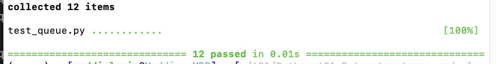
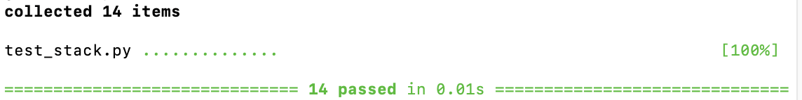

# Stacks and Queues
<!-- Description of the challenge -->
**push / enqueue**
- arguments: new value
- push: adds a new node with the given value at the top of the stack
- enqueue: adds a new node with the given value at the end of the queue

**pop / dequeue**
- arguments: none
- pop: removes the node at the top of the stack and returns its value
- dequeue: removes the node at the front of the queue and returns its value

**peek**
- arguments: none
- returns either the top of the stack's value or the front of the queue's value

**is_empty**
- arguments: none
- checks to see if a stack or queue is empty, returns a boolean

## Whiteboard Process
<!-- Embedded whiteboard image -->

)

[Link to Figma Board of image above for queues](https://www.figma.com/board/mLQ7CaCvtMPdlHjo5ZWVYZ/Code-Challenge-10%3A-Queues?node-id=0-1&t=23nMnN8z3lmMauEp-1)

[Link to Figma board of image above for stacks](https://www.figma.com/board/nQCtrHby7UWVY1O1mv1X4y/Code-Challenge-10%3A-Stacks?node-id=0-1&t=cjuH7GTkct6Ukaat-1)

## Approach & Efficiency
<!-- What approach did you take? Why? What is the Big O space/time for this approach? -->

Stacks: Time: O(1) - because only deals with one node at a time for all of these method, since the node’s being accessed are only on the top
Space: O(n) - because it will be the amount of space for each of the nodes in the stack

Queues: Time: O(1) - because only deals with one node at a time for all of these method, since it knows the head and tail of the queue
Space: O(n) - because it will be the amount of space for each of the nodes in the queue

## Solution
<!-- Show how to run your code, and examples of it in action -->

Terminal command:  python3 -m pytest

### Code Links

[Queue](python/stacks_and_queues/queue.py)
[Stack](python/stacks_and_queues/stack.py)

